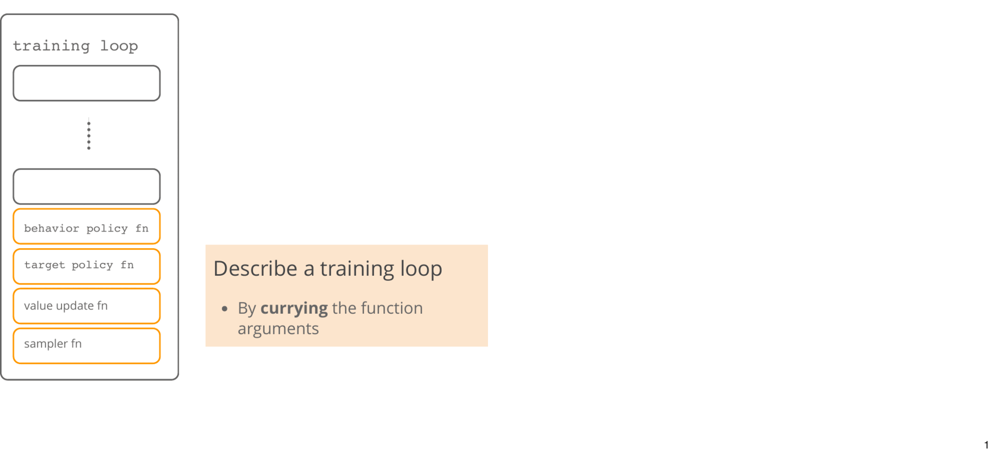

# Jaxdp


**Jaxdp** is a Python package that provides simple functional implementation of algorithms and commonly used functions in dynamic programming (DP) for finite state-action Markov decision processes (MDP) within the </img> ecosystem. Using the JAX transformations, you can accelerate (even using GPUs) DP algorithms by running multiple MDPs, initial values, seeds, etc. in a vectorized form.

# Vectorization

The functions in **jaxdp** are fully compatible with </img> transformations. They are memoryless, and the memory is explicitly provided to the functions. This design pattern does not hide information for the cost of being verbose. Therefore, **jaxdp** rely on [currying](https://docs.python.org/3/library/functools.html) whenever possible.

## Training Loop

**Jaxdp** provides vectorizable training functions for both planning and learning settings. Below is an abstract view of how currying and JAX transforms are used in a training loop:



## MDPs

Similarly, in **jaxdp**, MDPs are Pytrees and therefore compatible with JAX transforms.

```Python
import jax.numpy as jnp
import jax.tree_util

from jaxdp.mdp.garnet import garnet_mdp as make_garnet


n_mdp = 8
key = jax.random.PRNGKey(42)

# List of random MDPs with different seeds
mdps = [make_garnet(state_size=300, action_size=10, key=key,
                    branch_size=4, min_reward=-1, max_reward=1)
        for key in jrd.split(key, n_mdp)]

# Stacked MDP
stacked_mdp = jax.tree_map(lambda *mdps: jnp.stack(mdps), *mdps)
```

Once stacked, an MDP can be provided to a vectorized function such as training loop.

```Python
> mdps[0].transition.shape
> (10, 300, 300)

> stacked_mdp.transition.shape
> (8, 10, 300, 300)
```

> [!warning]
> The shapes of the components in the list of MDPs need to match to vectorize. Hence, we may not have a vectorized MDP with varying action or state sizes.

# Algorithms

Besides the common functions used in Dynamic Programming, **jaxdp** provides a list of value update algorithms.

|Planning Algorithms   |                  |
|:--------------------:|:----------------:|
|  VI                  |:heavy_check_mark:|
|  PI                  |:heavy_check_mark:|
|  Nesterov VI         |:heavy_check_mark:|
|  Accelerated VI      |:heavy_check_mark:|

> [!note]
> **jaxdp** makes a distinction between synchronous and asynchronous sampling.

|Learning Algorithms |Sync sampled      |Async sampled     |
|:------------------:|:----------------:|:----------------:|
|  TD($\lambda$)     |:x:               |:heavy_check_mark:|
|  Q-learning (QL)   |:heavy_check_mark:|:heavy_check_mark:|
|  Momentum QL       |:x:               |:x:               |
|  Speedy QL         |:heavy_check_mark:|:x:               |
|  Zap QL            |:heavy_check_mark:|:x:               |

# Installation

Recommended: Python 3.9+

Install the package in development mode via:

```bash
pip install -r requirements.txt
pip install -e .
```
